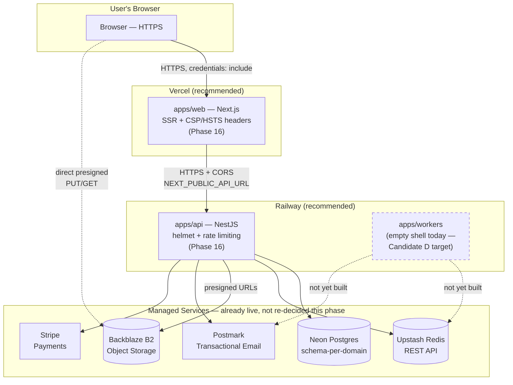

# Phase 17 — Deployment & Production Launch Guide

**Date:** 2026-08-06 · **Type:** Operational planning and documentation. **No hosting provider was selected or configured, no provider-specific files were committed, and no infrastructure was provisioned** — per this phase's explicit addendum, hosting selection, domain purchase, and DNS configuration are the project owner's decisions. This guide documents the comparison, gives one justified recommendation per area, and provides copy-paste-ready configuration so whoever executes the launch — including someone new to this project — can do so without re-deriving any of this from scratch.

---

## Executive Summary

Phoenix is Release Candidate 1 (Phase 16, approved): all 5 Critical engineering blockers are closed, security fundamentals are solid, and the platform runs correctly end-to-end in this development environment against real infrastructure (Neon Postgres, Upstash Redis, Backblaze B2, Stripe). **What has never happened is an actual production deployment** — no hosting provider is selected, no Dockerfile exists anywhere in the repository despite the architecture doc committing to containerizing the backend, Terraform is scaffolding-only (`infra/terraform/README.md` explicitly says "no resources are defined yet"), and one leftover config file (`apps/web/vercel.json`) is actively wrong and would interfere with a real deploy attempt if used as-is.

None of this is a code problem. It is exactly what this phase exists to plan: a real, evidence-based hosting comparison, a concrete deployment guide, and the operational checklists a first-time launcher needs. **This phase recommends Vercel (frontend) + Railway (backend/workers)**, with full reasoning below — but the final selection, and any domain/DNS work, remains the project owner's call.

---

## 1. Deployment Architecture — Hosting Comparison & Recommendation

### What needs hosting

| Component | Nature | Hosting requirement |
|---|---|---|
| `apps/web` | Next.js 14 App Router, SSR + static | Edge/CDN-friendly, Node.js runtime, environment variables at build+runtime |
| `apps/api` | NestJS, long-running HTTP server | Persistent process (not serverless-function-shaped), Node.js 22, environment variables + secrets |
| `apps/workers` | Currently an empty shell (no job processors yet) | Same runtime as `apps/api`; needs a persistent process once real jobs exist |
| Database | Already Neon (managed Postgres) — **not being re-decided this phase** | N/A — see §3 |
| Redis | Already Upstash (managed, REST-based) — **not being re-decided this phase** | N/A |
| Object storage | Already Backblaze B2 — **not being re-decided this phase** | N/A — see §4 |

Only `apps/web` and `apps/api`/`apps/workers` need a new hosting decision. The database/cache/storage providers were already chosen and are live in earlier phases (Phase 13.6/13.7) — re-litigating those is out of this phase's scope.

### Comparison: Railway vs. Render vs. Fly.io vs. Azure vs. AWS vs. Vercel

| | **Vercel** | **Railway** | **Render** | **Fly.io** | **Azure** | **AWS** |
|---|---|---|---|---|---|---|
| **Best fit here** | `apps/web` | `apps/api` + `apps/workers` | `apps/api` + `apps/workers` (close 2nd) | `apps/api` + `apps/workers` (if multi-region matters) | Either, if org already standardizes on Azure | Either, if org already standardizes on AWS |
| Next.js fit | Native, zero-config, built by the same company | Runs as a plain Node service — no edge/CDN specialization | Same as Railway | Runs in a container at the edge — needs a Dockerfile | Static Web Apps or App Service — more setup | Amplify/ECS/S3+CloudFront — more setup |
| Long-running Node process (NestJS) | **Not viable** — serverless function model, wrong shape for a persistent API + future background workers | Yes, first-class | Yes, first-class | Yes, first-class | Yes (App Service / Container Apps) | Yes (ECS Fargate, per the architecture doc's own original candidate) |
| Needs a Dockerfile | No | No (Nixpacks buildpack builds directly from `package.json`) — Docker optional | No (native runtime buildpack) — Docker optional | **Yes, required** | Optional depending on service type | Yes, for ECS |
| Setup complexity (first launch, small team) | Very low | Low | Low | Medium | High (IAM, resource groups, networking) | High (VPC, IAM, ALB, ECS task defs) — matches this project's own docs/09 warning against over-engineering "before there are thousands" of users |
| Background workers as a separate process | N/A (not for `apps/web`) | Yes — a second service in the same project, shares env vars easily | Yes — native "Background Worker" service type | Yes — a second `fly.toml` process group | Yes | Yes |
| Preview deployments per PR | Yes, native | Yes | Yes | Manual | Manual/extra setup | Manual/extra setup |
| Pricing model at this stage | Usage-based, generous free/hobby tier | Usage-based, predictable small-team pricing | Usage-based, similar to Railway | Usage-based, pay for always-on VMs | Enterprise pricing, higher floor | Enterprise pricing, higher floor |
| Already named in this project's own architecture doc | Yes (§21) | Yes (§21, alongside Fly.io/ECS) | No | Yes (§21) | No | Yes (§21, as ECS Fargate) |
| Operational overhead for a solo/small team | Lowest | Low | Low | Medium (region/volume config) | High | Highest |

### Recommendation

**Frontend (`apps/web`): Vercel.**
- Built by the Next.js team — zero-config support for the App Router, ISR, and the `headers()`-based CSP/security-header config added in Phase 16 (verified compatible — Vercel respects `next.config.mjs`'s `headers()` function natively, no translation needed).
- Already the architecture doc's own stated plan (§21), and evidence in the repo (`apps/web/vercel.json`) shows this app was deployed to Vercel before, even though that specific file is now stale (see the Action Items below — it predates this monorepo and needs correcting, not reusing as-is).
- Lowest operational overhead of any option compared, which matters directly: this is a first production launch, not a mature ops team's tenth deployment.

**Backend + Workers (`apps/api`, `apps/workers`): Railway.**
- Matches the architecture doc's own named candidates (§21: "AWS ECS Fargate / Railway / Fly.io").
- No Dockerfile is strictly required (Railway's Nixpacks buildpack builds directly from `package.json`'s `build`/`start` scripts, which already exist and are already verified working) — removing the one real setup cost Fly.io would add (a Dockerfile that doesn't exist anywhere in this repo yet).
- Meaningfully lower setup complexity than AWS ECS Fargate, directly consistent with this project's own documented philosophy (`docs/09-PLATFORM-ARCHITECTURE.md`: "deliberately 'boring' at launch... not over-engineering for millions of users before there are thousands").
- `apps/workers` can run as a second Railway service in the same project, sharing the same environment variables — the natural place to build Candidate D's Notifications worker whenever that phase happens.
- **Close alternative: Render.** Functionally comparable to Railway in almost every dimension in the table above — if the project owner has an existing preference or account, Render is a reasonable substitute with no meaningful downside identified in this comparison.

**Not recommended for this launch:** Fly.io (real setup cost — no Dockerfile exists, and its main advantage, multi-region edge deployment, doesn't matter yet for a first launch with no measured geographic traffic pattern), Azure and AWS (both real, capable platforms, but their setup complexity is disproportionate to Phoenix's current stage and team size — appropriate to revisit if/when the platform outgrows a managed-PaaS model, not before).

**This is a recommendation, not a decision.** Per this phase's explicit instruction, the project owner makes the final call — all six options' real tradeoffs are documented above precisely so that decision can be made with full information, not deferred by lack of it.

### Infrastructure Diagram



---

## 2. Environment Variables — Production Guide

### Production `.env.example` (backend, `apps/api`)

The real `apps/api/.env.example` already documents every variable the running code reads (kept current through Phase 16). Reproduced here with production-specific annotations — **this is documentation, not a new file**; the real one already exists and is current:

```bash
# --- Server ---
PORT=4000                              # Railway/Render set this automatically; do not hardcode in prod

# --- Database (Neon) ---
DATABASE_URL=                          # Production Neon connection string, sslmode=require&channel_binding=require

# --- Redis (Upstash) ---
UPSTASH_REDIS_REST_URL=
UPSTASH_REDIS_REST_TOKEN=

# --- Search (not yet integrated into any backend module — provisioned, unused) ---
MEILISEARCH_HOST=
MEILISEARCH_API_KEY=

# --- Auth (RS256 key pair — PRODUCTION KEYS MUST DIFFER FROM DEV) ---
JWT_PRIVATE_KEY=                       # PEM, generate fresh for production — never reuse the dev keypair
JWT_PUBLIC_KEY=
JWT_ACCESS_TOKEN_TTL=15m
JWT_ISSUER=phoenix-platform

# --- Secrets (PRODUCTION VALUES MUST DIFFER FROM DEV) ---
PASSWORD_PEPPER=                       # 32 random bytes, base64 — generate fresh for production
MFA_ENCRYPTION_KEY=                    # 32 random bytes, base64 — generate fresh for production

# --- Object Storage (Backblaze B2) ---
STORAGE_ENDPOINT=
STORAGE_BUCKET=                        # Recommend a SEPARATE bucket for production vs. this dev environment's bucket
STORAGE_ACCESS_KEY_ID=
STORAGE_SECRET_ACCESS_KEY=
STORAGE_REGION=

# --- Payments (Stripe LIVE keys, not test keys) ---
STRIPE_SECRET_KEY=                     # sk_live_..., never sk_test_... in production
STRIPE_WEBHOOK_SECRET=                 # from the production webhook endpoint's own signing secret

# --- AI Gateway ---
AI_PROVIDER_OPENAI_API_KEY=
AI_PROVIDER_ANTHROPIC_API_KEY=

# --- Email (Postmark) ---
POSTMARK_API_KEY=                      # production Server Token, not the test token
EMAIL_FROM_ADDRESS=                    # must be on a DNS-verified sending domain — see §5
EMAIL_FROM_NAME=Phoenix Project
```

### Production `.env.example` (frontend, `apps/web`)

```bash
NEXT_PUBLIC_SITE_URL=https://phoenix.example          # the real production domain, once chosen (see §11)
NEXT_PUBLIC_API_URL=https://api.phoenix.example       # the real production API domain
```

### Required Secrets — Generation Commands

| Secret | Command | Rotation risk if changed |
|---|---|---|
| `JWT_PRIVATE_KEY`/`JWT_PUBLIC_KEY` | `openssl genrsa -out private.pem 2048 && openssl rsa -in private.pem -pubout -out public.pem` | **Low-risk to rotate** — invalidates all outstanding access tokens (15-min TTL, so impact is bounded) and requires a fresh login; does not affect stored data. |
| `PASSWORD_PEPPER` | `node -e "console.log(require('crypto').randomBytes(32).toString('base64'))"` | **Never rotate casually** — every stored password hash was computed with this pepper; rotating it invalidates every user's ability to log in until they reset their password. Treat as effectively permanent once set in production. |
| `MFA_ENCRYPTION_KEY` | Same command as above | **Never rotate casually** — already documented in the real `.env.example`: rotating invalidates every enrolled user's stored TOTP secret (forced re-enrollment). |
| `STRIPE_WEBHOOK_SECRET` | From the Stripe Dashboard, per registered webhook endpoint | Safe to rotate (update in Stripe Dashboard + env var together); no stored data depends on it. |
| `POSTMARK_API_KEY` | From the Postmark account's "API Tokens" tab | Safe to rotate any time (revoke old, add new); no stored data depends on it. |

### Rotation Recommendations

- **JWT keypair:** rotate on a fixed schedule (e.g., annually) or immediately on suspected compromise — low blast radius given the short access-token TTL and the existing refresh-token/session-revocation infrastructure already built (Phase 11).
- **`PASSWORD_PEPPER` / `MFA_ENCRYPTION_KEY`:** do not rotate on a schedule. Generate once, for production, correctly, and store in whatever secrets manager the chosen hosting provider offers (Railway/Render/Vercel all have built-in encrypted environment variable storage — sufficient at this stage; a dedicated secrets manager like AWS Secrets Manager or HashiCorp Vault is not a Phase 17 requirement, but worth revisiting if/when the platform scales beyond a single hosting provider).
- **`STRIPE_SECRET_KEY` / `STORAGE_ACCESS_KEY_ID`:** rotate per the provider's own security recommendations (Stripe and Backblaze both support generating a new key and revoking the old one without downtime — do this in that order, never revoke-then-generate).
- **General principle, already established in this codebase's own security posture (Phase 16):** no secret is ever hardcoded, no secret is ever logged, and `.env` is excluded from version control (verified `.gitignore` coverage in Phase 16's security review) — production secrets should be set directly in the hosting provider's environment-variable UI/CLI, never committed anywhere, not even in a "production.env" file in the repo.

---

## 3. Database Deployment (Neon)

**Already live and in use** — this section documents operational practice for production, it does not change the provider (Neon was already selected and is already the working database throughout this project's history).

- **Backups:** Neon's paid tiers include continuous, automatic backups with **point-in-time restore (PITR)** — the real, primary recovery mechanism for data-level incidents (bad migration, accidental delete, corrupted write). This is a Neon *account/plan* setting, not application code — confirm the production Neon project is on a plan with PITR enabled and note the retention window (commonly 7–30 days depending on plan) before launch.
- **Migration strategy:** this project already uses Prisma Migrate correctly (`prisma migrate dev` locally, confirmed in Phase 16 to produce clean, reviewable SQL migrations). **For production, the command must be `prisma migrate deploy`, never `prisma migrate dev` and never `prisma db push`** — `migrate dev` can prompt for destructive resets in some conflict scenarios, and `db push` bypasses the migration history table entirely (`docs/known-issues.md` already documents a real, previously-discovered incident where this exact mistake left `_prisma_migrations` out of sync with the live schema, only recoverable via manual baselining). `migrate deploy` is the only production-safe command: it applies pending migrations in order and refuses to run if the migration history is inconsistent, rather than guessing.
- **Rollback strategy:** Prisma does not auto-generate reversible "down" migrations. The real, honest production rollback strategy is two-layered:
  1. **Schema-level:** if a bad migration is deployed, the fix is a new forward migration that undoes the change (e.g., a migration that drops a column just added), not a magic "undo" — this is standard practice for any migration-based schema tool, not a Phoenix-specific gap.
  2. **Data-level:** Neon's PITR (above) is the real safety net for "the migration itself was fine but the deploy corrupted/lost data" — restore the database to a timestamp before the incident, independent of the application code's rollback (see §9, Disaster Recovery, for the full procedure).
- **Not yet true, disclosed honestly:** Terraform (`infra/terraform/README.md`) is scaffolding-only — the current Neon/Upstash/B2 setup was provisioned manually across earlier phases, not via Infrastructure-as-Code as the architecture doc originally envisioned (§21: "Terraform for all cloud resources — no manual console changes, every environment reproducible from git"). This is a real gap between documented intent and current reality — the production database exists and works, but is not currently reproducible from a `terraform apply`. Worth a future phase if reproducibility becomes a real operational need; not a launch blocker, since the database already works correctly today.

---

## 4. Object Storage

**Already live: Backblaze B2**, provisioned in Phase 13.7, S3-compatible, verified working end-to-end (presigned upload → real PUT → magic-byte MIME detection on complete → confirmed delete).

- **Media:** the primary real use today — course video/image lessons, instructor media library uploads. Confirmed working, path-style addressing forced correctly in code.
- **Certificates:** **architecturally wired to the same storage, but not actually populated.** `certificates.service.ts`'s own file header states the real, current state plainly: "no PDF-rendering library/service exists anywhere in this codebase yet. Certificates are issued with `pdfFileId: null`." Every certificate a learner earns today has no PDF file in object storage — the download/presigned-URL code path exists and is correct, but nothing ever calls it because nothing generates the PDF in the first place. **This is a real, pre-existing gap, not a new Phase 17 finding** — documented here because it directly affects what "object storage in production" actually needs to serve at launch (media only, not yet certificates).
- **Uploads:** direct-to-storage via presigned URLs — the application server never buffers untrusted file bytes (confirmed in Phase 15's security review as a real strength, unaffected by this phase).
- **Retention:** no automated retention/lifecycle policy exists in code or Backblaze B2 configuration today. Recommend, before launch: (a) a bucket lifecycle rule for soft-deleted files (`File.deletedAt` is set in the database, but the underlying B2 object is not automatically purged after a retention window — currently soft-deleted files remain in storage indefinitely), and (b) a decision on how long orphaned/incomplete uploads (a presigned URL issued but never completed) should live before cleanup. Neither exists today; both are cheap B2 bucket-lifecycle-rule configuration, not application code changes — a reasonable pre-launch or early-post-launch task, not a blocker.
- **Recommendation: use a separate production bucket from this development environment's bucket**, not the same one — keeps real user uploads isolated from test/dev artifacts (the current dev bucket already has real accumulated test data per Phase 15's findings — `storage-verify-*`, E2E fixtures, etc.).

---

## 5. Email Production Readiness (Postmark)

Phase 16 built the real `EmailService` integration; this section covers what's needed **beyond the code** for production email to actually land in inboxes rather than spam folders or bounce entirely.

### DNS Requirements (all configured at the domain registrar/DNS provider, not in this codebase)

| Record | Purpose | Status |
|---|---|---|
| **SPF** (`TXT` on the sending domain) | Declares which servers are allowed to send mail as this domain — Postmark provides the exact record to add | **Not configured** — no production domain is chosen yet (see §11) |
| **DKIM** (`TXT`, Postmark-provided selector) | Cryptographically signs outgoing mail so receiving servers can verify it wasn't forged — generated per-domain inside the Postmark dashboard after adding the sending domain | **Not configured** — depends on domain choice |
| **DMARC** (`TXT` on `_dmarc.<domain>`) | Tells receiving servers what to do with mail that fails SPF/DKIM (quarantine/reject) and where to send reports — not Postmark-specific, a standard DNS record | **Not configured** — depends on domain choice |
| **Return-Path / custom MAIL FROM domain** (optional, Postmark supports it) | Improves deliverability further by aligning the bounce-handling domain with the sending domain | Optional, recommended once the above three are working |

### Postmark-Specific Production Checklist

1. Create a production Postmark server (separate from any test/dev server) — this is what `POSTMARK_API_KEY` in the production environment variables should point to.
2. Add and verify the real sending domain in Postmark's dashboard — this generates the exact SPF/DKIM TXT records to add at the DNS provider.
3. Add those records at the DNS provider (Cloudflare, Route53, the domain registrar's own DNS, etc. — whichever is chosen once a domain is selected).
4. Add the DMARC record (Postmark doesn't generate this one automatically the way it does SPF/DKIM — it's a standard record independent of the email provider; start with `p=none` to monitor before moving to `p=quarantine`/`p=reject`).
5. Wait for DNS propagation (can take minutes to 48 hours depending on the provider and existing TTLs) and confirm verification status turns green in Postmark's dashboard before sending real production mail.
6. Set Postmark's "Message Stream" to `outbound` (transactional) — already correctly hardcoded in `EmailService`'s `sendEmail` call (Phase 16), not something to change.
7. Set `EMAIL_FROM_ADDRESS` in production to an address on the now-verified domain (e.g. `noreply@phoenix.example`) — using an unverified domain, or a free-mail address like Gmail, will fail Postmark's own sending requirements.
8. Send one real test email (e.g., trigger a real password-reset flow against the production environment with a real inbox you control) before considering email "launched" — DNS records showing "verified" in Postmark's dashboard is necessary but not sufficient proof real inboxes will accept the mail cleanly.

**Blocked on:** a production domain being chosen (§11) — every item above depends on it. This is explicitly not this phase's decision to make.

---

## 6. Monitoring

### What already exists (Phase 16)
- `GET /api/v1/health` — reports `{ database, redis, storage, stripe, email }` as booleans. Real, live, `@Public()`. This is a **passive health check**, not active monitoring — something (an uptime service, a load balancer's health-check config) needs to actually poll it on a schedule for it to provide any real value.
- Structured request logging via `LoggingInterceptor` (pre-existing) and NestJS's own `Logger` throughout the codebase (all the auth/MFA/email/storage services log meaningfully, confirmed throughout Phases 13–16).

### What does not exist yet, and is needed before/shortly after launch

| Capability | Current state | Recommendation |
|---|---|---|
| **Uptime monitoring** | None | Point an external uptime service (many hosting providers, including Railway and Vercel, have basic built-in health-check-based restart policies; a dedicated service like Better Uptime, UptimeRobot, or Checkly adds real alerting) at `GET /api/v1/health` |
| **Centralized log aggregation** | Logs go to stdout only, captured by whatever the hosting platform captures (Railway/Render both capture stdout logs natively with a searchable UI — sufficient at this stage without adding a dedicated log aggregator) | Use the chosen hosting platform's built-in log viewer initially; revisit a dedicated tool (Axiom, Better Stack, Datadog) only if log volume/retention needs outgrow it |
| **Metrics (request rate, latency, error rate)** | None — no APM library integrated | Not a launch blocker for a first production deploy at this scale; recommended as an early post-launch addition (see Post-Launch Checklist) rather than a pre-launch requirement |
| **Crash/error reporting** | None — errors are logged via the global `AllExceptionsFilter` (Phase 15 confirmed this never leaks internal detail on 500s) but not aggregated/alerted anywhere | Recommend Sentry (or equivalent) for both `apps/api` and `apps/web` — real, low-effort integration, genuinely valuable for catching production-only bugs a local dev environment won't surface. Not implemented this phase (would be a real code change, out of this phase's "operational, not feature development" scope) — documented as a concrete near-term follow-up. |
| **Alerts** | None | Depends on the uptime/error-reporting tools chosen above — configure alert thresholds only after picking those tools |

**Engineering note, not a decision:** none of the above requires re-litigating any architecture decision — they're additive tools layered onto the existing, working health-check and logging foundation. Recommended priority order if implemented post-launch: (1) uptime monitoring on `/health` (cheapest, highest immediate value), (2) crash reporting (Sentry), (3) metrics/APM (only once there's real traffic to measure).

---

## 7. Production Security Review

This section confirms what Phase 16 already verified live, and calls out what changes specifically for a production domain (as opposed to `localhost`).

| Area | Status | Production-specific note |
|---|---|---|
| **HTTPS** | Not yet applicable (dev is HTTP on localhost) | Both Vercel and Railway (and Render/Fly.io) provision free, automatic TLS certificates for any domain attached to them — no manual certificate management needed. HSTS is already configured in code (Phase 16, `max-age=31536000; includeSubDomains; preload`) and will take effect automatically once served over real HTTPS. |
| **Cookies** | Verified solid (Phase 15/16): `httpOnly`, `secure`, `sameSite: 'strict'`, scoped to `/api/v1/auth` | The `secure` flag means the refresh cookie **will not be sent at all** if the production API is ever accessed over plain HTTP — confirm the chosen hosting provider forces HTTPS (both Vercel and Railway do this by default) before launch, or logins will silently fail to persist. |
| **CORS** | Verified solid: scoped to a single configured origin via `NEXT_PUBLIC_SITE_URL`/`frontendOrigin`, not a wildcard | **Must be updated** for production — `apps/api`'s CORS origin is read from `NEXT_PUBLIC_SITE_URL` at runtime (`apps/api/src/main.ts`); this needs to be the real production frontend domain, not `http://localhost:3000`, or the deployed frontend will be blocked from calling the deployed API. |
| **Security headers** | Verified live (Phase 16): CSP/HSTS/X-Frame-Options/X-Content-Type-Options/Referrer-Policy/Permissions-Policy on both apps | No production-specific change needed — these are already environment-independent. The frontend CSP's `connect-src` already includes the real `NEXT_PUBLIC_API_URL` value at build time (Phase 16) — confirm this env var is set correctly at build time on whichever hosting platform is chosen, not just at runtime, since Next.js's `headers()` config is evaluated per-request but reads `process.env` values that must be available in that environment. |
| **Secrets** | Verified solid: `.gitignore` excludes `.env*`, nothing hardcoded | Production secrets must be set directly in the hosting provider's environment variable UI/CLI — see §2. Re-confirm no `.env` file is ever accidentally included in a deploy (Vercel/Railway both respect `.gitignore` for what gets deployed from a git-connected repo, so this should already be safe by construction, not something to manually re-check per deploy). |
| **Rate limits** | Verified solid (Phase 15/16): global 120 req/min, tighter `@Throttle` limits on all sensitive auth endpoints, Redis-backed account lockout | Unaffected by hosting choice — this is all application-level, backed by Upstash Redis, which is already the same in dev and would be the same in production (same Redis instance or a separate production instance, per §2's recommendation to isolate prod from dev resources generally). |

---

## Production Checklist

Nothing omitted — every item below is real and specific to this codebase's actual current state, not generic boilerplate.

- [ ] Hosting provider selected for `apps/web` (recommend Vercel, §1) — **owner decision**
- [ ] Hosting provider selected for `apps/api`/`apps/workers` (recommend Railway, §1) — **owner decision**
- [ ] Production domain purchased/available (e.g. `phoenix.example`) — **owner decision**
- [ ] DNS provider chosen and access confirmed (Cloudflare, Route53, registrar's own DNS, etc.) — **owner decision**
- [ ] Fresh RS256 JWT keypair generated for production (never reuse the dev keypair)
- [ ] Fresh `PASSWORD_PEPPER` generated for production
- [ ] Fresh `MFA_ENCRYPTION_KEY` generated for production
- [ ] Separate production Backblaze B2 bucket created (not the dev bucket)
- [ ] Separate production Neon database/branch confirmed, with PITR/backups enabled on the plan
- [ ] Separate production Upstash Redis instance (or clearly isolated database index) confirmed
- [ ] Stripe account switched to live mode; live `STRIPE_SECRET_KEY` and a real production webhook endpoint + `STRIPE_WEBHOOK_SECRET` configured
- [ ] Production Postmark server created; sending domain added
- [ ] SPF, DKIM, DMARC DNS records added and verified (§5)
- [ ] `apps/web/vercel.json` corrected or removed before deploying to Vercel — **it is currently a stale, wrong-format leftover from a different, unrelated project** (`"name": "ai-productivity-platform"`, legacy Vercel v2 `builds` syntax) and will not produce a correct zero-config Next.js deploy if used as-is
- [ ] `NEXT_PUBLIC_SITE_URL`/`NEXT_PUBLIC_API_URL` set to real production domains on the frontend hosting platform (build-time AND runtime)
- [ ] `apps/api`'s CORS origin (reads `NEXT_PUBLIC_SITE_URL`) confirmed pointing at the real production frontend domain
- [ ] `prisma migrate deploy` run against the production database (never `migrate dev`, never `db push`) — see §3
- [ ] HTTPS confirmed enforced on both deployed apps (should be automatic on Vercel/Railway, but verify, since `secure` cookies silently fail over plain HTTP)
- [ ] `GET /api/v1/health` confirmed reachable from the public internet and returns `"status": "ok"` (all 5 checks true) once every above item is complete
- [ ] Uptime monitor pointed at `/health` (§6)
- [ ] One real end-to-end test performed against production: register a real account, receive a real verification email, verify it, log in, enable MFA, receive a real MFA-enabled email — not a synthetic/mocked check

---

## Disaster Recovery

### Rollback Plan (bad deploy, code-level issue)

1. Both recommended platforms (Vercel, Railway) keep every previous deploy as an immutable, addressable artifact — rollback is **redeploying the previous known-good build**, not reverting git commits and rebuilding (matches the architecture doc's own already-stated intent, §21).
2. If the bad deploy included a database migration, **do not roll back the application code alone** — a newer schema with older code is a common source of subtle corruption. Roll back application code and evaluate the migration separately (see Recovery Plan below).
3. Confirm rollback success via `GET /api/v1/health` and a real login attempt, not just "the deploy succeeded."

### Backup Plan

1. **Database:** Neon's continuous backup/PITR (§3) is the primary mechanism — confirm the production Neon project's plan includes it, and note the exact retention window before launch (this is a Neon account setting to check, not something this codebase controls).
2. **Object storage:** Backblaze B2 supports bucket versioning/lifecycle rules — not currently configured (§4); recommend enabling object versioning on the production bucket specifically so an accidental overwrite/delete of a real user's uploaded file is recoverable, not just soft-deleted at the database level.
3. **Configuration/secrets:** the *values* of production secrets should exist in at least two places outside the hosting provider's own storage (e.g., a password manager or the founding team's secrets vault) — losing access to the hosting provider's dashboard should not mean losing the ability to reconstruct the production environment from scratch.

### Recovery Plan (data-level incident — bad migration, accidental deletion, corruption)

1. **Stop the bleeding first:** if the issue is an in-progress bad deploy, roll back the application (above) immediately — this stops new bad writes, it does not fix already-corrupted data.
2. **Assess scope:** determine the real timestamp the corruption began (audit logs — `AuditLog`/`Log` tables, already real and populated per Phase 15's database review — are the first place to check, since they're append-only and time-ordered).
3. **Restore via Neon PITR** to a timestamp immediately before the incident began, into a **new branch** first (Neon supports branching a database at a point in time without affecting the live production branch) — verify the restored data looks correct before making any decision to cut over.
4. **Reconcile the gap:** any real, legitimate writes that happened between the restore point and the incident (e.g., real orders/enrollments) will be lost by a straight restore — this is a real tradeoff inherent to point-in-time recovery, not specific to Phoenix, and should be weighed against the severity of the corruption before deciding to cut over vs. a more surgical manual fix.
5. **Post-incident:** write up what happened in `docs/known-issues.md` following this project's own established pattern (every prior incident in this project's history — the migration-history baselining issue, the P2034 payment race, etc. — is documented this way, not silently fixed and forgotten).

---

## Launch Checklist

### Pre-Launch (before any production traffic)
- [ ] Every item in the Production Checklist above is complete
- [ ] A full regression pass re-run against the actual production deployment (not just this dev environment) — register, login, MFA enroll, browse courses, complete a real (small, refundable) purchase, verify the certificate/notification/admin surfaces all load
- [ ] Rollback procedure tested at least once in a non-production environment (e.g., deploy a trivial change to a staging environment, then practice rolling it back) so it's not being learned for the first time during a real incident
- [ ] Team/owner knows exactly where production logs, the health endpoint, and the hosting provider's dashboard are — written down, not tribal knowledge

### Launch Day
- [ ] Deploy during a low-traffic window if there's any existing traffic to consider (not applicable for a true first launch with zero existing users, but worth stating for the record)
- [ ] Watch `GET /api/v1/health` and the hosting platform's live logs for the first real user sessions
- [ ] Confirm the first real registration/verification-email/login cycle succeeds end-to-end with a real, non-test inbox
- [ ] Confirm the first real Stripe payment (if any occurs on day one) completes and the webhook fires correctly
- [ ] Keep the rollback procedure ready and rehearsed, not just documented

### Post-Launch (first days/weeks)
- [ ] Monitor error rates via whatever logging the hosting platform provides (dedicated crash reporting, §6, is a fast-follow, not required for hour one)
- [ ] Confirm Postmark's dashboard shows real deliverability (bounce rate, spam complaints) trending normally, not spiking
- [ ] Revisit the deferred items from Phase 16 (dependency major-version upgrades, especially Next.js given its Critical-severity `npm audit` findings) now that there's a real production baseline to protect
- [ ] Configure object storage retention/lifecycle rules (§4) if not already done pre-launch
- [ ] Add crash reporting (Sentry or equivalent) and basic metrics/APM (§6) as the first real post-launch engineering additions

---

## Operational Risks

1. **No Dockerfile exists anywhere in the repository**, despite the architecture doc committing to containerizing `apps/api`/`apps/workers`. Not a blocker for the recommended Railway path (Nixpacks doesn't need one), but would become one immediately if Fly.io, ECS, or Azure Container Apps were chosen instead — a real, direct consequence of the hosting choice, not an independent gap.
2. **`apps/web/vercel.json` is actively wrong** and would produce an incorrect deploy if used as-is on Vercel without correction — a concrete, specific pre-launch action item, not a vague warning.
3. **Terraform is scaffolding-only** — the current production-candidate infrastructure (Neon, Upstash, B2) is manually provisioned, not reproducible from code. Real operational risk if the person who set it up leaves or access is lost, though not a launch blocker since it already works.
4. **No monitoring/alerting exists beyond the new passive health check** — a real production incident could go undetected until a user reports it, until an uptime monitor is actually configured against `/health`.
5. **Certificates have no real PDF generation** — if certificate delivery is expected to be a real, working feature at launch (not just "the enrollment/completion tracking works"), this is a genuine functional gap, pre-existing, not created or fixed this phase.
6. **The async Notification email channel remains unbuilt** (Candidate D) — in-app notifications work; email notifications for the same events do not, beyond the specific auth-flow emails Phase 16 wired up.
7. **27 dependency vulnerabilities remain unpatched** (Phase 16), including 1 Critical (Next.js) — real exposure that predates and is independent of the hosting decision.
8. **No production domain, DNS, or hosting account exists yet** — every item in §5 (email DNS) and part of §1/§7 (CORS/HTTPS config) is blocked on this one owner decision, and nothing in this guide can proceed past the "documented and ready" stage until it's made.

---

## Engineering Recommendation

Phoenix's engineering readiness (Phase 16: Production Readiness 80/100) is not the limiting factor for launch — **the limiting factor is entirely operational and awaits owner decisions this phase correctly does not make unilaterally**: which hosting provider, which domain, and executing the DNS/environment-variable setup that follows from those choices. Every checklist in this document is written to be followed by someone with no prior context on this project, step by step, once those decisions are made.

**Recommended sequence once the owner decides:** (1) purchase/confirm the domain, (2) create the Vercel and Railway accounts and connect the repo, (3) work through the Production Checklist top to bottom, (4) run the full Launch Checklist. Estimated real elapsed time once a domain is chosen: a few hours of configuration plus DNS propagation wait time (up to 48 hours, usually much less) — not a multi-week effort, because the application itself is already done.

---

## Go / No-Go Decision

**Status: No-Go today — blocked entirely on owner decisions, not engineering work.**

Phoenix **is** ready to launch once the following are true, in order:

1. **A hosting provider is chosen** for `apps/web` and for `apps/api`/`apps/workers` (this guide recommends Vercel + Railway; Render is an equally valid substitute for the latter).
2. **A production domain is chosen and DNS access is available** — required for HTTPS, CORS configuration, and every part of §5 (email deliverability).
3. **Fresh production secrets are generated** (JWT keypair, password pepper, MFA encryption key) — never reuse this development environment's values.
4. **Every item in the Production Checklist is complete**, and the Launch Checklist's pre-launch section is fully checked off.

**No condition above requires new engineering work** — every one is configuration, an account, or a decision. Once all four are satisfied, the recommendation converts from **No-Go** to **Go** without needing to revisit this document's technical content. This guide does not need to be re-written when that happens — it needs to be *executed*.
