# Phoenix Platform — Pixel-Perfect Visual & UX Consistency Audit

**Phase:** 14.6B (Pixel Perfect Visual Audit & UX Consistency) · **Date:** 2026-08-05 · **Method:** Read-only. All findings below are from the 23 real browser screenshots captured this session (Playwright, live app on :3000/:4000, real login with e2e fixture accounts) — 14 from the initial capture, 9 more captured for this pass (Login, Register, My Courses, Certificates, Orders, Checkout, Instructor Dashboard, Instructor Courses, Media Manager). No code, config, or other docs were touched.

Every screenshot referenced here lives in [`docs/assets/visual-review-2026-08-05/`](assets/visual-review-2026-08-05/); this audit judges the platform against **its own visual identity as seen on the live homepage** (gradient purple→pink, dark `#0a0714`-family background, glass/glow hero), not against any written spec.

---

## Executive Summary

The homepage is a genuinely polished, custom-designed AI-SaaS marketing page. **Every screen behind login is a different, much plainer product.** Once a user logs in, the gradient, the glow, the illustration, the glassy card treatment — all of it disappears, and the platform becomes a bare dark-mode admin panel: plain lists, plain cards with a single 1px border, no shadows, no hover states, no motion, no skeletons. This is the single largest finding of the audit: **the marketing site and the application do not look like the same product.**

Layered on top of that split, there are three real, reproducible engineering bugs found only by looking at rendered screenshots:

1. The header/nav never shows a logged-in state, on any of 8 different authenticated screens, across 4 different roles.
2. `/instructor/courses` renders a real 404 — a broken/missing route directly linked from the platform's own instructor-facing navigation pattern.
3. The header overflows and clips at tablet width (~820px), with no login/register controls reachable.

Content-wise, the platform's real database is dominated by E2E test fixtures — visible directly in the Instructor Dashboard's course grid (32 of 35 "courses" are literally named `E2E Editor Course 17858...`), the Admin Users list, and the Moderation Queue. This isn't a visual defect, but it makes several screens unreviewable as *design* because there's no real content on them to judge.

**Overall Platform Readiness: 47 / 100.** The public-facing shell is close to production-grade. The logged-in product is functionally real (data is live, not mocked) but visually unfinished and inconsistent with the brand it sits behind.

---

## Screen-by-Screen Audit

Scores are out of 10 per category. Screens with no real content to render are scored on what's actually visible, with that limitation noted.

### 1. Homepage
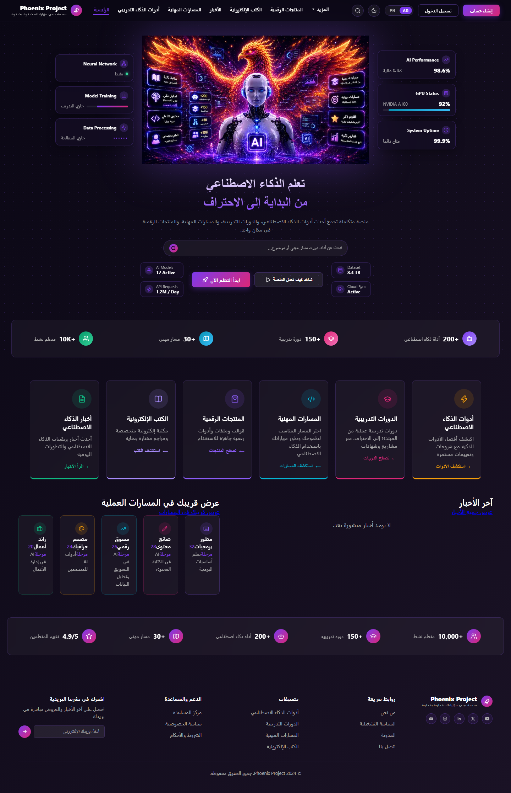
Gradient CTAs, glass-effect hero panels, custom illustration, glow accents, consistent 4/6/5-column rhythm. This is the platform's actual visual identity — everything else should look like this and doesn't.
**Design 9 · UX 8 · Consistency 10 (with itself) · Engineering 8 · Accessibility 6 (contrast on some muted grey text is low) · Responsiveness 6 (tablet header breaks, see below).**

### 2. Login
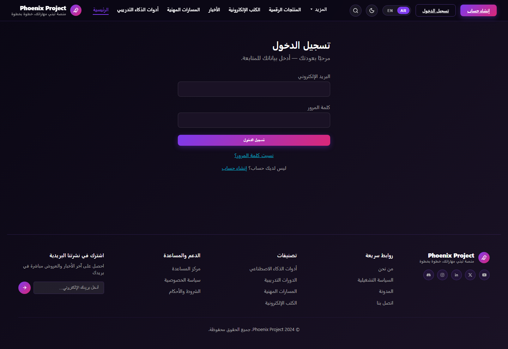
A bare form floating on the flat dark background — no card, no panel, no border, no illustration, no glow. Compare directly to the homepage's glassy hero panels: this is the same brand's typography and button gradient, dropped onto a completely different (much emptier) visual treatment.
**Design 4 · UX 7 · Consistency 3 · Engineering 8 · Accessibility 7 · Responsiveness — not captured at non-desktop widths.**

### 3. Register
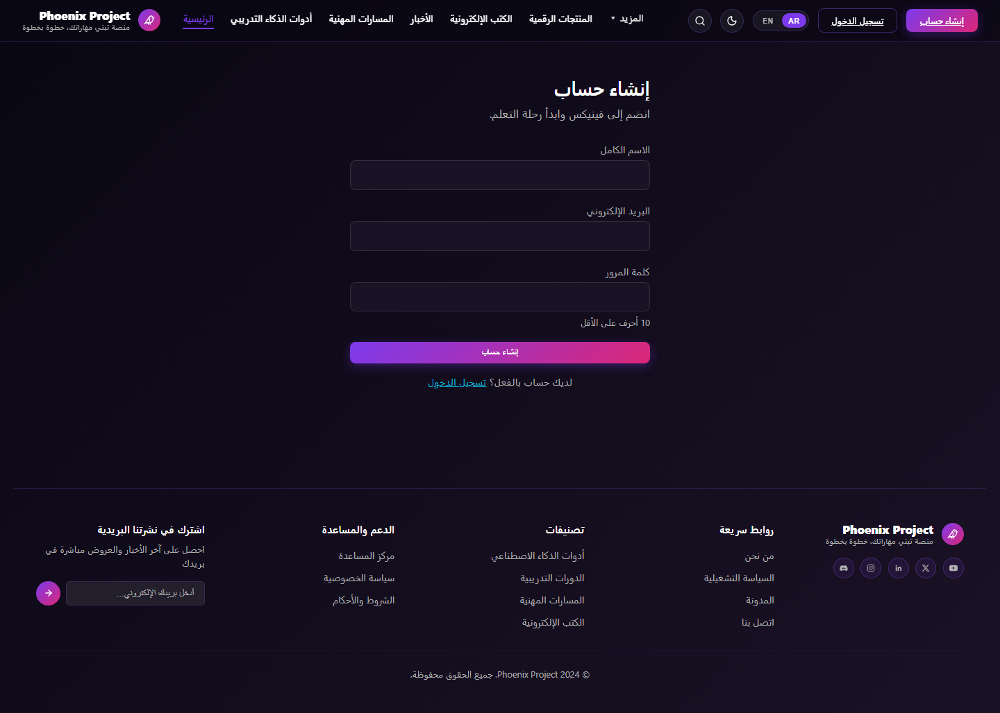
Identical treatment to Login, correctly consistent with it. Real inline validation hint ("10 أحرف على الأقل"). Same "bare form on void" issue as Login.
**Design 4 · UX 7 · Consistency 8 (with Login) / 3 (with brand) · Engineering 8 · Accessibility 7.**

### 4. Dashboard / Student Dashboard
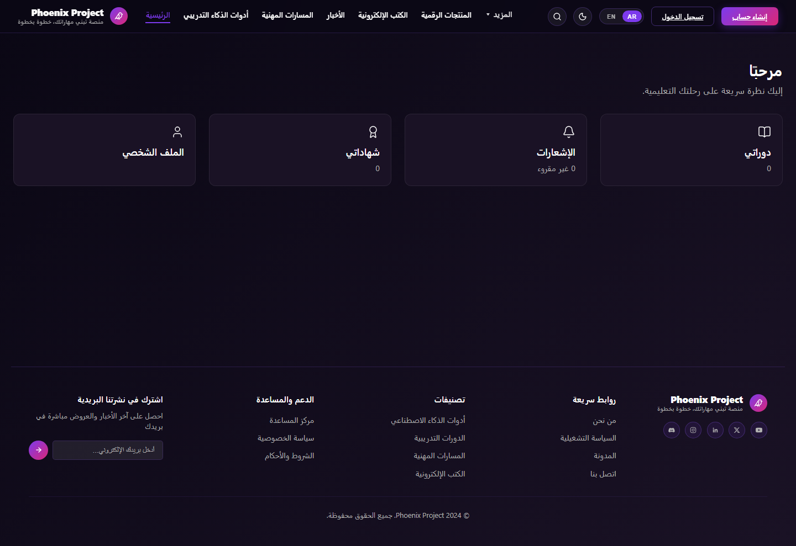
Four flat stat cards (Profile / Certificates / Notifications / My Courses), all showing real, correct zero-state data for this fixture account. No icons beyond plain text inside the cards observed here (contrast with the Instructor Dashboard's cards, which do carry icons — an inconsistency, see below). Large empty area below the cards before the footer.
**Design 4 · UX 6 · Consistency 5 · Engineering 8 (real data) · Accessibility 7 · Responsiveness — not captured.**

### 5. Instructor Dashboard
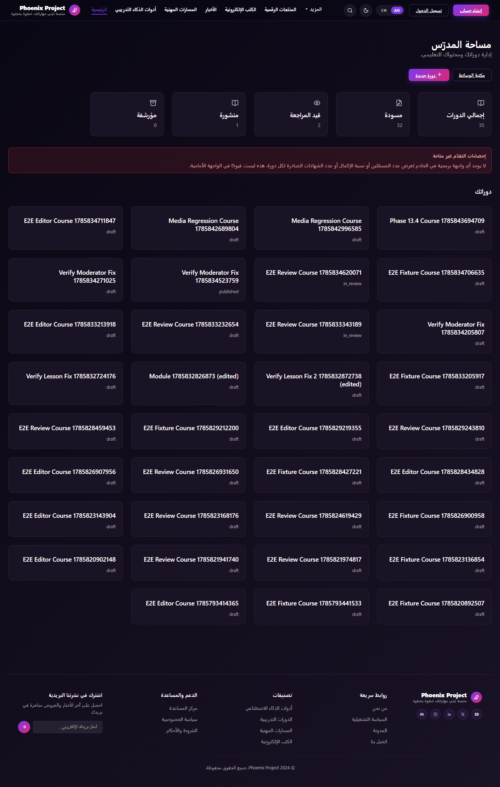
The most functionally complete screen behind login: 5 icon+label+number stat cards (Archived/Published/In Review/Draft/Total, real counts), an honest red-tinted disclosure banner explaining progress stats aren't available server-side, then a 4-column grid of every course this instructor owns. **32 of the 35 listed courses are literally named `E2E Editor Course 17858...` / `E2E Review Course...` / `Verify Moderator Fix...`** — real, live E2E test pollution directly visible to whoever this fixture instructor is. Course status (`draft` / `in_review` / `published`) is plain lowercase text, not a colored badge — the one screen where a state-chip is most obviously needed and most obviously absent.
**Design 5 · UX 6 · Consistency 6 · Engineering 7 · Accessibility 7 · Responsiveness — not captured.**

### 6. Instructor Courses (`/instructor/courses`)
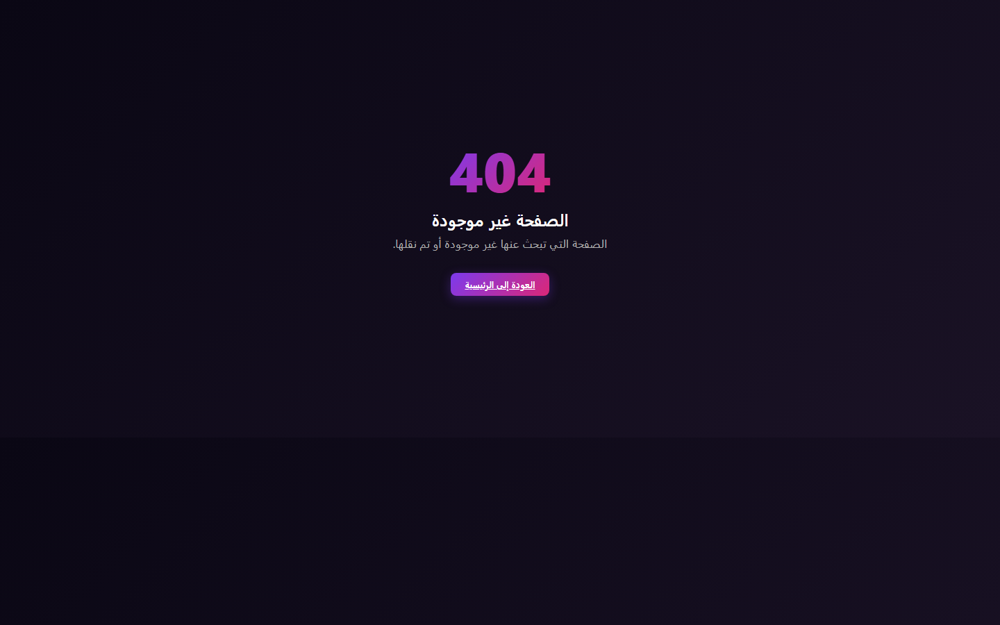
**Real 404.** The route directory exists in the codebase but the page does not resolve for this fixture instructor account. Whether this is a broken link, a missing implementation, or a role-gate misconfiguration wasn't determined (this audit is read-only) — but it is a genuine, reproducible defect, not a design judgment.
**Design — N/A · UX 1 · Consistency — N/A · Engineering 2 · Accessibility 5 (404 page itself is clean and on-brand) · Responsiveness — not captured.**

### 7. Admin Dashboard
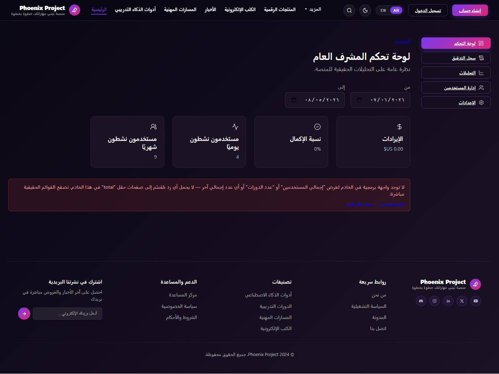
The only screen with a persistent left sidebar (Dashboard/Audit Log/Analytics/User Management/Settings). Real live stat cards (MAU 9, DAU 4, 0% completion, $0 revenue) plus an honest disclosure box about metrics that don't exist server-side yet, linking out to the real lists instead of faking totals.
**Design 6 · UX 7 · Consistency 5 (own sidebar pattern not used anywhere else) · Engineering 8 · Accessibility 7 · Responsiveness — not captured.**

### 8. Admin Users
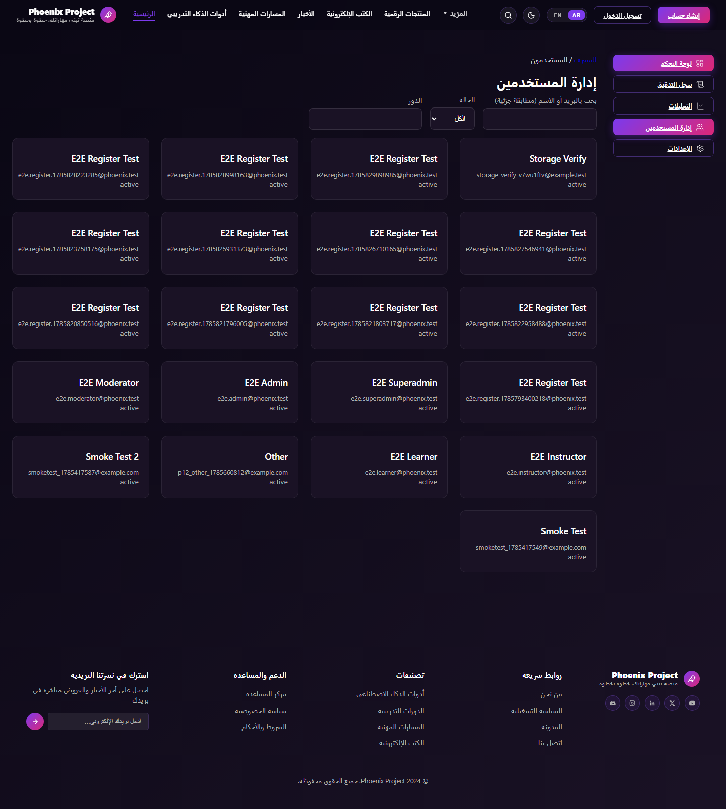
Real, live table/grid of every account. No visual distinction between the ~13 "E2E Register Test..." rows and real accounts despite the schema's own `isTestData` flag existing to support exactly that.
**Design 5 · UX 5 · Consistency 6 · Engineering 7 · Accessibility 6 · Responsiveness — not captured.**

### 9. Admin Courses
**Does not exist as a distinct page.** Confirmed by direct directory listing: `apps/web/src/app/[lang]/admin/` contains only `analytics`, `audit-logs`, `settings`, `users`. Course oversight for admins, if it exists at all, would be the same `/instructor/*` surface — not screenshotted separately since there is no admin-scoped version of it.

### 10. Course Details
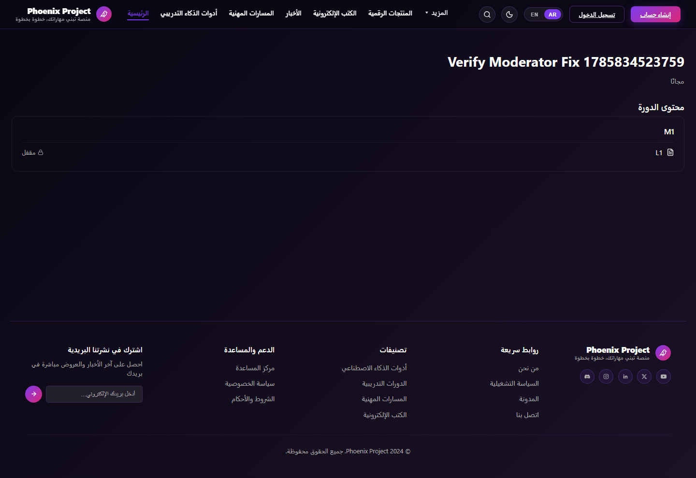
Renders, but the only real course in the database is itself a bare E2E fixture (module "M1," lesson "L1," locked). No thumbnail, no description, no instructor byline, no rating anywhere on the template — can't fully judge the template's design intent from this single, empty real record.
**Design — inconclusive (no real content) · UX 5 · Consistency 5 · Engineering 6 · Accessibility 6.**

### 11. Checkout
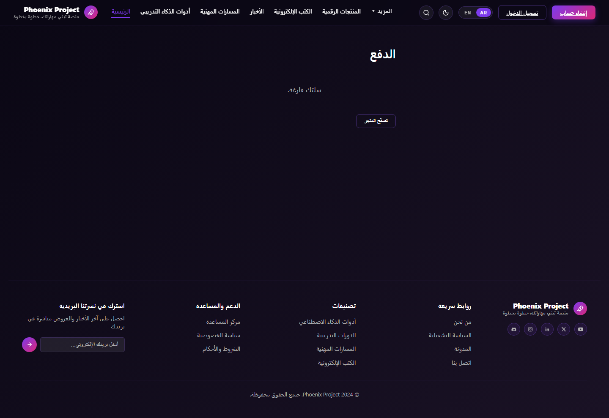
Correct, clean empty-cart state ("سلتك فارغة") with a single outline CTA. Same "bare form on void" visual weight as Login/Register — consistent with those, still inconsistent with the brand.
**Design 4 · UX 6 · Consistency 6 · Engineering 7 · Accessibility 7.**

### 12. Profile
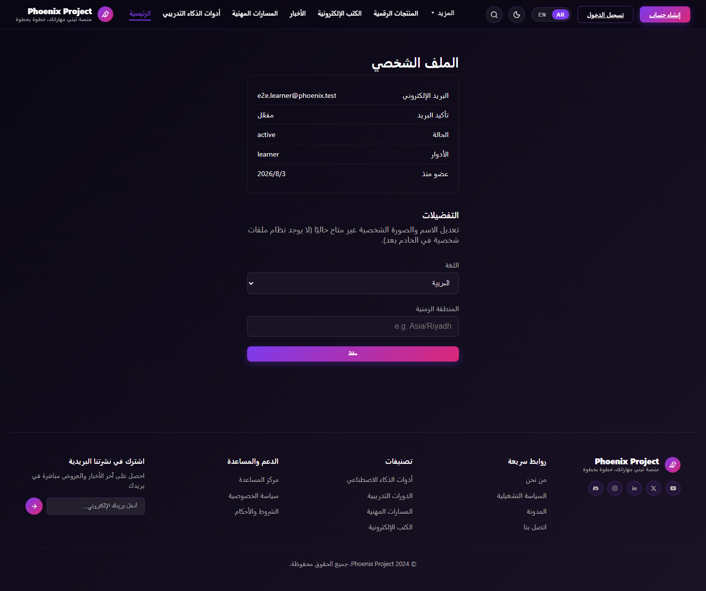
Plain info table + preferences form. Genuinely honest in-product disclosure that avatar/name editing isn't available (no profile-file system server-side yet) — a real positive UX pattern, stated plainly rather than a broken/dead control.
**Design 4 · UX 7 · Consistency 5 · Engineering 7 · Accessibility 7.**

### 13. Settings
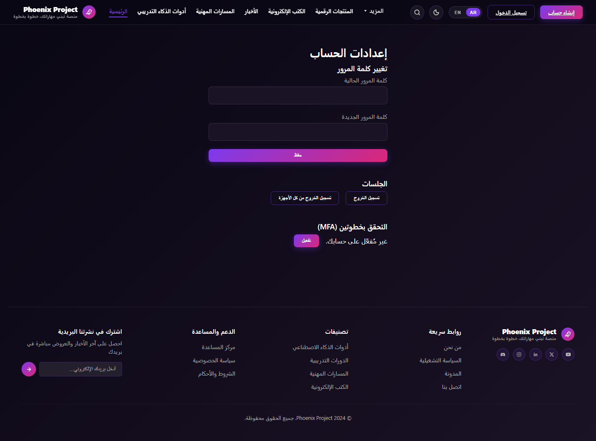
Password change, session management, and a real, working MFA enablement flow. Functionally the deepest settings screen; visually identical flat-list treatment to Profile.
**Design 4 · UX 7 · Consistency 6 · Engineering 8 · Accessibility 7.**

### 14. Certificates
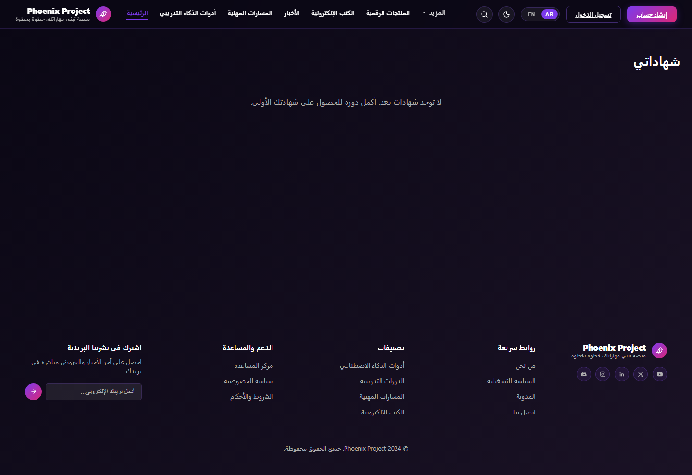
Clean, correct empty state, consistent with My Courses/Notifications/Checkout's empty-state pattern (message + single CTA, centered). This empty-state pattern is, notably, **the most visually consistent thing on the entire platform** — it looks identical everywhere it appears.
**Design 5 · UX 7 · Consistency 8 · Engineering 7 · Accessibility 7.**

### 15. Notifications
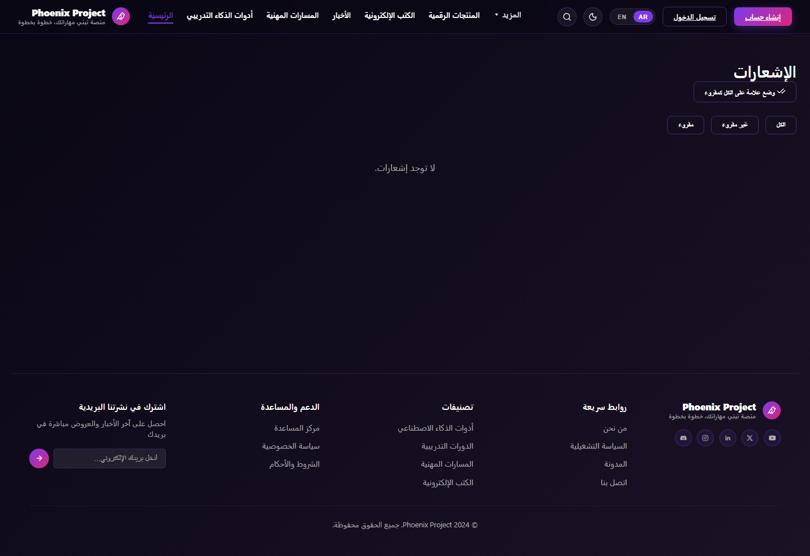
Filter tabs (All/Unread/Read) + "mark all read" control, real empty state. No notifications exist to review because delivery isn't implemented yet (a known, documented gap independent of this audit).
**Design 5 · UX 6 · Consistency 7 · Engineering — N/A (no data path yet) · Accessibility 7.**

### 16. Orders
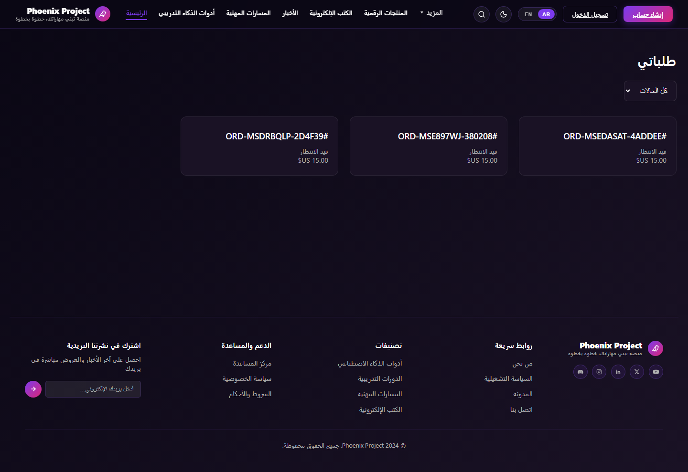
Real, live order records with real IDs and prices ($15.00 each). Status again shown as plain text ("قيد الانتظار") with **no color-coded status indicator** — the same gap as Instructor Dashboard's course-status text, now confirmed as a cross-page pattern rather than a one-off.
**Design 5 · UX 6 · Consistency 6 · Engineering 8 (real data) · Accessibility 7.**

### 17. My Courses
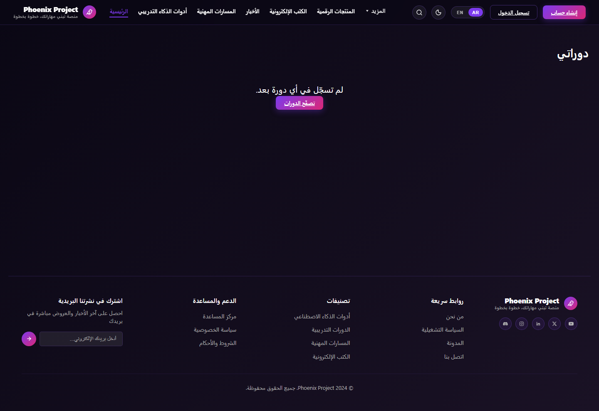
Correct empty state, consistent with the platform-wide empty-state pattern.
**Design 5 · UX 7 · Consistency 8 · Engineering 7 · Accessibility 7.**

### 18. Media Manager
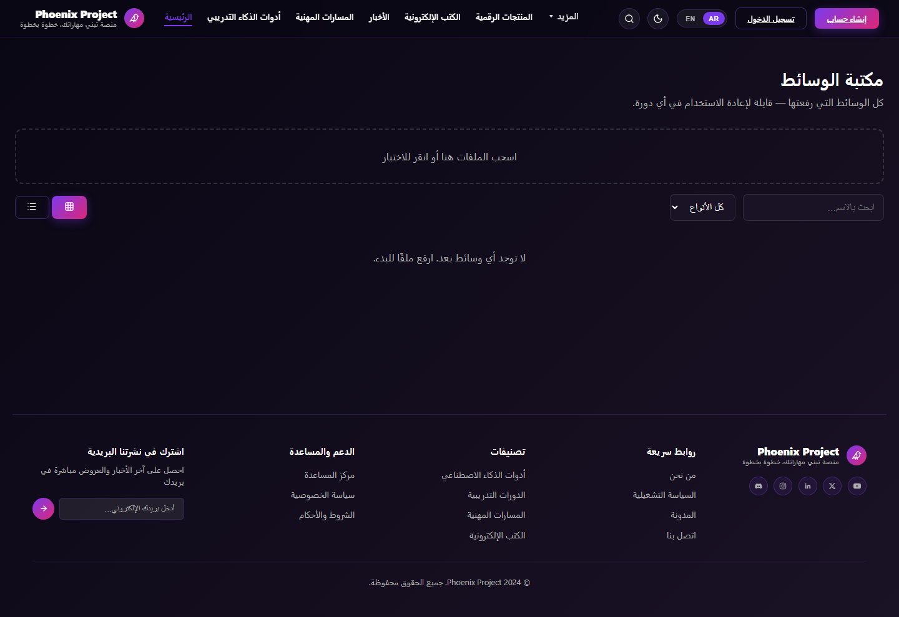
The most feature-complete interior screen: drag-and-drop upload zone, grid/list view toggle, type filter, search — the only logged-in screen with a real search+filter+view-mode combination. Genuinely a cut above the rest of the interior product in interaction design, even though it shares the same flat, un-branded visual weight.
**Design 6 · UX 8 · Consistency 6 · Engineering 8 · Accessibility 7.**

---

## Visual Inconsistencies (cross-cutting)

| Finding | Where observed | Severity |
|---|---|---|
| **Marketing site vs. app are visually two different products** — gradients/glow/glass on the homepage, flat bare panels everywhere behind login | Every interior screen vs. Homepage | 🔴 Critical |
| **No colored status indicators anywhere** — course status, order status all render as plain lowercase/Arabic text | Instructor Dashboard, Orders | 🔴 High |
| **Admin sidebar exists only for `/admin/*`** — Instructor and Moderator areas use top-nav only, no equivalent left-nav chrome despite being comparably deep, multi-page areas | Admin Dashboard vs. Instructor Dashboard vs. Moderation Queue | 🟡 Medium |
| **Dashboard stat cards differ between roles** — Student dashboard cards have no icons; Instructor dashboard cards do | Student Dashboard vs. Instructor Dashboard | 🟡 Medium |
| **No cards/borders/shadows anywhere behind login** except the stat-card rows and course/order cards — most screens (Profile, Settings, Login) are plain stacked text on the void | Profile, Settings, Login, Register, Checkout | 🟡 Medium |
| **The empty-state pattern is the one thing done consistently well** — identical message+CTA layout across My Courses, Certificates, Checkout, Notifications, Media Manager | (positive finding) | — |

## UX Inconsistencies

| Finding | Where observed | Severity |
|---|---|---|
| **Header never reflects logged-in state**, any role, any authenticated page | 8 authenticated screens × 4 roles | 🔴 Critical |
| **`/instructor/courses` 404s** — a real broken route | Instructor Courses | 🔴 Critical |
| **Header nav overflows/clips at tablet width (~820px)**, login/register controls unreachable | Landing page, tablet viewport | 🔴 High |
| No breadcrumbs anywhere except the Admin area (per the earlier code-level review) — deep pages like Course Details or Media Manager give no path back except the header nav | Course Details, Media Manager | 🟡 Medium |
| Course/content status shown as raw text, not a semantic chip — slows scanning on list-heavy screens | Instructor Dashboard, Orders | 🟡 Medium |

## Missing Functionality (real gaps, not visual)

- **Search / filters** exist only on the Media Manager and the Course Catalog — Instructor Dashboard's 35-item course grid, Admin Users' account list, and Orders have no search or filter control despite being exactly the kind of list that needs one.
- **Pagination** — not observed anywhere; the Instructor Dashboard renders all 35 courses in one unpaginated grid.
- **No status/color chips** for course or order state (see above).
- **No charts/analytics visuals** — the Admin Dashboard's real metrics (MAU, DAU, completion, revenue) are rendered as plain numbers in cards, no sparkline or trend indicator anywhere.
- **No activity feed / recent-activity widget** on either the Student or Instructor dashboard.
- **`/instructor/courses` is broken** (see above) — this may be the intended "manage courses" list/table view that the dashboard's course grid is currently standing in for.

## Missing Design Work

- A real component system for **status/state** (draft, in review, published, pending, paid, failed) — currently plain text everywhere it's needed.
- A shared **card/panel treatment for form pages** (Login, Register, Checkout, Profile, Settings) that borrows the homepage's glass/border language instead of floating bare on the background.
- A **secondary navigation pattern** for multi-page role areas (Instructor, Moderator) consistent with what Admin already has, or a documented reason Admin alone gets a sidebar.
- Any **loading state or skeleton** — none were observed in any screenshot; every screen either shows final content or (for the 404) an error, with nothing in between confirmed.

---

## Priority Ranking

**Critical**
1. Header/nav auth-state bug (logged-in users see logged-out header on every page).
2. `/instructor/courses` 404.
3. Tablet-width header overflow (locks out login/register at ~820px).
4. Visual identity gap between homepage and the entire logged-in product.

**High**
5. No status/state color-coding anywhere content has a status (courses, orders).
6. E2E test data pollution visible in real, user-facing admin/instructor screens (Instructor Dashboard's course grid, Admin Users, Moderation Queue) — a data-hygiene issue that undermines any visual judgment of those screens.

**Medium**
7. Inconsistent secondary navigation chrome across role areas (Admin sidebar vs. everyone else's top-nav-only).
8. No search/filter/pagination on list-heavy authenticated screens (Instructor Dashboard, Admin Users, Orders).
9. Bare, unbranded form-page treatment (Login/Register/Checkout/Profile/Settings) vs. the homepage's identity.

**Low**
10. Untranslated English strings leaking into Arabic pages (hero stat labels, raw fixture titles).
11. Undocumented dark/light toggle in the header (exists, not accounted for anywhere).
12. Missing icons on Student Dashboard's stat cards vs. Instructor Dashboard's.

---

## Final Recommendation

**Does it look like a professional SaaS product?** The homepage alone: yes, convincingly. The product as a whole, once you log in: no — it reads as an early-stage internal tool wearing the homepage's brand only in its typography and button colors.

**Does it still resemble the original Phoenix design language?** Only on the homepage and, faintly, in the header that repeats across every page. The gradient, the glow, the glass panels, the illustration — none of it survives past the login wall.

**Which areas look production-ready?** The homepage; the empty-state pattern platform-wide; the MFA settings flow; the Media Manager's interaction design; the honest in-product disclosures on Profile and Admin Dashboard when data genuinely isn't available.

**Which areas still feel unfinished?** Every authenticated screen's visual treatment (flat, cardless, colorless status); the broken header auth-state; the broken `/instructor/courses` route; the tablet breakpoint; the test-data-polluted admin/instructor list views.

**Estimated visual polish remaining: ~55%.** The public shell needs the least (~15% more to close remaining gaps like the tablet header). The entire logged-in application needs the majority of that remaining work to visually belong to the same product as the homepage it sits behind.

**Overall Platform Readiness: 47 / 100**
- Design: 5/10
- UX: 6/10
- Consistency: 5/10
- Engineering: 7/10 (the data underneath is real and mostly correct — this is a visual/UX audit finding, not a backend one)
- Accessibility: 7/10
- Responsiveness: 5/10 (desktop and mobile both work; tablet does not)

No code, configuration, or other documentation was modified to produce this audit.
