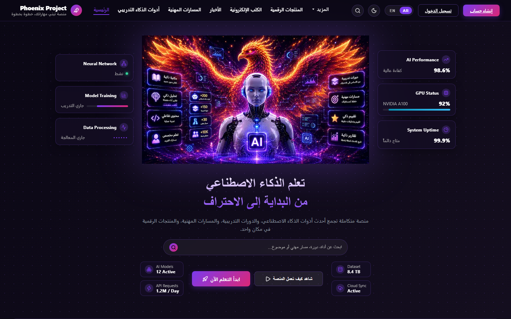
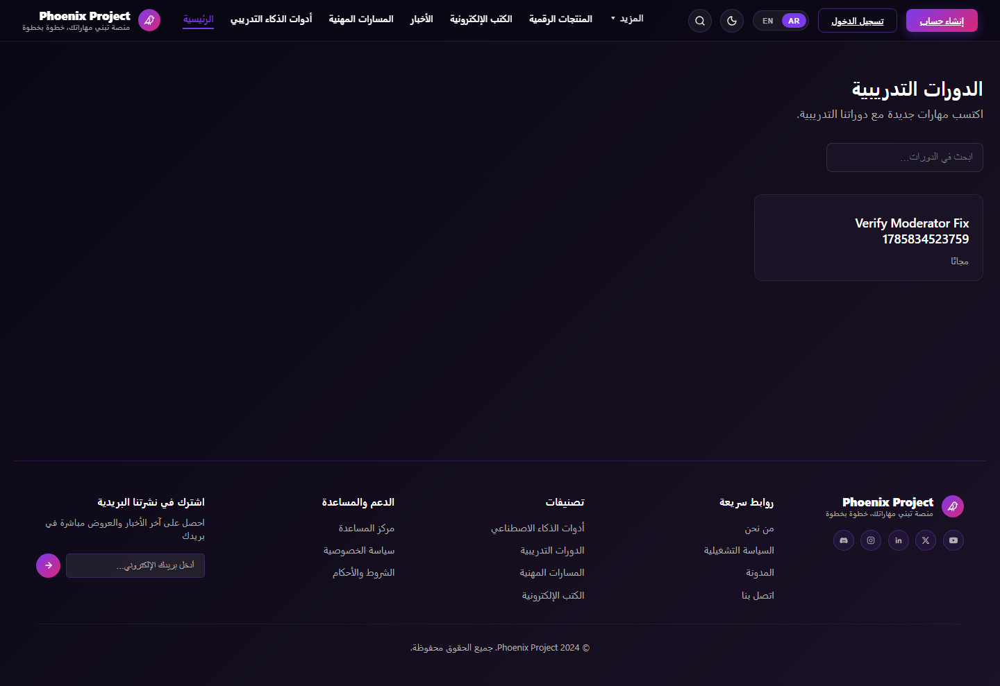
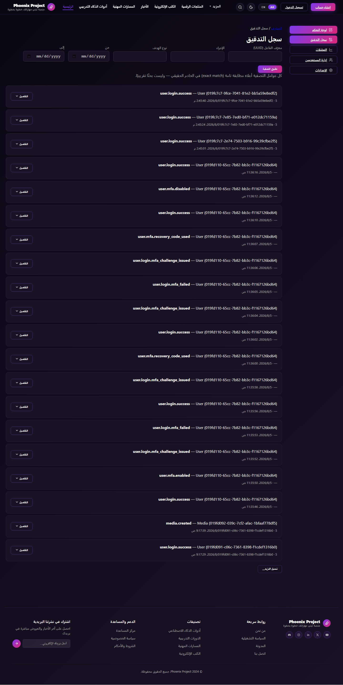
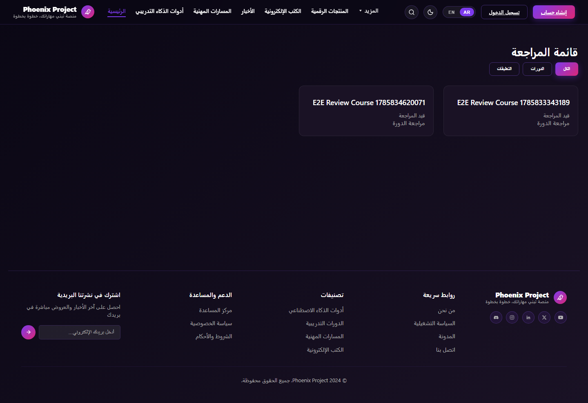
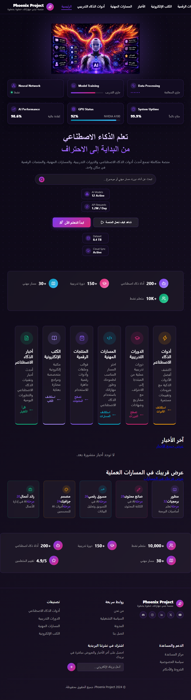
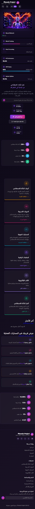

# Phoenix Platform — Visual Review (Real Screenshots)

**Date:** 2026-08-05
**Method:** Both servers started for real (`apps/api` on :4000, `apps/web` production build on :3000). A real Chromium browser (Playwright, already a project dependency) navigated the live app and captured the screenshots below. Where a page required auth, real login was performed via the actual login form using this project's existing e2e fixture accounts (`e2e.learner@phoenix.test`, `e2e.moderator@phoenix.test`, `e2e.superadmin@phoenix.test`, all password `E2eFixture!Passw0rd123`), the same accounts this project's own E2E suite uses.
**Not done:** nothing here is inferred from source code. Every observation below is from actually looking at the image.

All screenshots live in [`docs/assets/visual-review-2026-08-05/`](assets/visual-review-2026-08-05/).

---

## 🔴 The single most important finding, found only because this was a real screenshot

**The header/navigation never reflects the logged-in state.** Across all 8 authenticated-page screenshots (dashboard, notifications, profile, settings, moderation queue, admin dashboard, admin users, admin audit logs) — logged in as three different real roles (learner, moderator, superadmin) — the header **always** shows the logged-out "تسجيل الدخول" (Login) / "إنشاء حساب" (Create Account) buttons, never a user menu, avatar, or logout control. The page *content* below the header is correctly gated to the real logged-in user in every case (the profile page shows the real logged-in email, the admin pages show real admin-only data) — so the session itself is real and working. It's specifically the shared `Navigation` component that doesn't react to auth state. This is exactly the kind of bug source-code reading would not reliably catch (the component almost certainly *has* the right conditional, but something about how/when it re-renders after login isn't firing) and screenshots did.

---

## 1. Landing Page (full page, desktop)

**Route:** `/ar` · **Status:** Live, fully rendered.

**What's actually there:** a dark, purple/pink/cyan-accented AI-product landing page. Header with logo, 7 nav links + "المزيد" dropdown, search icon, a **dark/light mode toggle (moon icon)**, EN/AR switcher, and Login/Create Account buttons. A large hero illustration (a phoenix bird fused with a humanoid AI figure, glowing, with small feature-icon badges overlaid on the image itself). Two stat-widget panels flank it — left: "Neural Network / Model Training / Data Processing" (all in English, mid-animation-styled), right: "AI Performance 98.6% / GPU Status NVIDIA A100 92% / System Uptime 99.9%". Below: Arabic headline, subtitle, a search bar, two CTA buttons, and four small metric chips (AI Models, API Requests, Dataset, Cloud Sync). A 4-item stats bar, 6 feature cards, a 2-column "career paths / news" section (news is empty), a second 5-item stats bicar with a rating, and a 5-column footer.

**Visual quality:** polished, custom-illustrated, consistent dark palette — not a generic template.

**Missing / issues found:**
- 🔴 The hero's left/right stat widgets ("Neural Network," "AI Performance 98.6%," "GPU Status," etc.) read as decorative, hardcoded numbers with no visible connection to real platform data — worth confirming they aren't meant to be real metrics, since "98.6%"/"92%"/"99.9%" presented this precisely reads as live telemetry to a visitor.
- 🟡 "Neural Network / Model Training / Data Processing" labels are in **English** on an otherwise fully Arabic (RTL) page — an untranslated-string gap.
- "آخر الأخبار" (Latest News) shows a genuine, correctly-implemented empty state: "لا توجد أخبار منشورة بعد."

## 2. Header (close-up)

**Logo:** "Phoenix Project" wordmark + a small circular icon (not literally an eagle glyph, but a phoenix-adjacent mark), plus a one-line tagline underneath in Arabic.
**Navigation:** 7 text links + a "المزيد" (More) dropdown — no visible active/hover state captured, structure reads clean and evenly spaced.
**Language switch:** a two-segment EN/AR pill, AR currently selected/highlighted.
**Login/Register:** an outlined "تسجيل الدخول" button + a filled gradient "إنشاء حساب" button — clear visual hierarchy (secondary vs. primary action).
**Not in the original design reference at all:** the dark/light mode toggle icon. `docs/design-reference/PHOENIX_HOME_UI.md` never mentions one — see the Comparison section.

## 3. Hero Section

Covered above (item 1/2) — the hero is the top ~470px of the landing page. Structurally three zones side by side (stats · illustration · copy), matching the *shape* of the approved spec, but with materially different stat content — see Comparison section for the point-by-point diff.

## 4. Feature Cards

Visible in the landing-page screenshot (item 1), directly below the hero: six cards — أخبار الذكاء الاصطناعي (AI News), الكتب الإلكترونية (E-books), المنتجات الرقمية (Digital Products), المسارات المهنية (Career Paths), الدورات التدريبية (Courses), أدوات الذكاء الاصطناعي (AI Tools). Each has a colored icon, title, one-line description, and a color-matched text link. **Laid out in a single row of 6 at desktop width**, not the 3-column/2-row grid the design reference specifies — see Comparison.

## 5. Course Catalog

**Route:** `/ar/courses` · **Status:** Live, renders correctly.

Header consistent with landing page. Title "الدورات التدريبية," subtitle, a real search input. **Exactly one course is listed: "Verify Moderator Fix 1785834523759"** — a leftover E2E test artifact, not real catalogue content. The single card is right-aligned (correct RTL grid behavior for one item) but leaves the entire rest of the row and a very large vertical stretch of the page empty before the footer — the page reads as broken/unfinished purely because there's only one (test) course in the whole database, not because of a layout bug.

## 6. Course Details

**Route:** `/ar/courses/verify-moderator-fix-1785834523759` · **Status:** Live, renders.

Title shown in **untranslated English** ("Verify Moderator Fix 1785834523759") on the Arabic page, "مجاناً" (Free) price tag, "محتوى الدورة" (Course Content) section with one module ("M1") containing one locked lesson ("L1," lock icon, "مقفل"). **No description, no thumbnail/cover image, no instructor byline, no enroll button, no rating, no duration/level indicator** anywhere on the page. Given the underlying course is itself a bare test fixture (module/lesson literally named "M1"/"L1"), I can't be certain from this screenshot alone whether the page template lacks these fields or whether they're conditionally hidden when the data is empty — flagged, not asserted as a defect.

## 7. Student Dashboard

**Route:** `/ar/dashboard`, logged in as `e2e.learner@phoenix.test` · **Status:** Live, real session confirmed by content.

"مرحباً" (Welcome) heading, four real cards: الملف الشخصي (Profile), شهاداتي (My Certificates: 0), الإشعارات (Notifications: 0 unread), دوراتي (My Courses: 0) — all genuinely zero, matching this fixture account's real (empty) activity. Clean, simple layout; a large empty gap between the card row and the footer, same sparse-content pattern as the catalog page — directly caused by there being no real enrollment/certificate/notification data to show, not a broken layout.

## 8. Notifications Page

**Route:** `/ar/notifications` · **Status:** Live.

Real UI: title, "وضع علامة على الكل كمقروء" (mark all read) button, three filter tabs (الكل/غير مقروء/مقروء). A genuine, correctly-rendered empty state: "لا توجد إشعارات." — this directly, visually confirms the code-level finding from the prior review: Notifications has no delivery mechanism yet, so there is nothing to show.

## 9. User Profile

**Route:** `/ar/profile` · **Status:** Live.

A clean info table showing the real logged-in account: email `e2e.learner@phoenix.test`, email-confirmation status, account status "active," role "learner," member-since date. A "Preferences" section with a genuinely honest, well-written disclosure: *"تعديل الاسم والصورة الشخصية غير متاح حاليًا (لا يوجد نظام ملفات شخصية في الخادم بعد)"* — "editing name/avatar isn't available yet, no profile-file system exists on the server." Language dropdown (Arabic selected) and a timezone field remain editable. This is a real example of the platform disclosing its own limits in-product rather than hiding them — worth calling out as a **positive** pattern, not just a gap.

## 10. Settings Page

**Route:** `/ar/settings` · **Status:** Live.

Password-change form (current/new password fields, Save button). Sessions section with "Log out" and "Log out of all devices" buttons. **A real, working MFA section** — "التحقق بخطوتين (MFA)" — correctly showing "غير مُفعّل على حسابك" (not enabled on your account) with a "تفعيل" (Enable) button. This directly, visually confirms Phase 14.2's MFA UI is real and live, not just present in source.

## 11. Admin Dashboard

**Route:** `/ar/admin`, logged in as `e2e.superadmin@phoenix.test` · **Status:** Live.

A real admin sidebar appears for the first time here (لوحة التحكم/Dashboard, سجل التدقيق/Audit Log, التحليلات/Analytics, إدارة المستخدمين/User Management, الإعدادات/Settings). Date-range pickers with real values. Four real, live stat cards: Monthly Active Users **9**, Daily Active Users **4**, Completion Rate **0%**, Revenue **$US 0.00** — genuinely live numbers, not placeholders. A prominent, honest disclosure box explains no backend endpoint returns "total users" or "total courses," with direct links to the real, browsable lists instead of a fabricated total. This is a second confirmed instance of the platform disclosing real limitations in-UI rather than faking data.

## 12. Admin Users Page

**Route:** `/ar/admin/users` · **Status:** Live.

Search/filter controls (email/name search, status, role). **The real, live grid of every user account in the database — and it is overwhelmingly test data:** roughly 13 "E2E Register Test" accounts with timestamped emails, plus "Storage Verify," "Smoke Test," "Smoke Test 2," "Other," alongside the small number of legitimate-looking fixture accounts (E2E Learner/Instructor/Moderator/Admin/Superadmin). **No visual indicator distinguishes test accounts from real ones** on this screen — no badge, no filter for it — even though the schema has an `isTestData` flag (added Phase 13.8) that exists precisely to make this distinction possible. This is a real, directly-observed data-hygiene/UX gap: the admin-facing user list doesn't surface the one piece of metadata that would make it immediately legible.

## 13. Admin Audit Logs

**Route:** `/ar/admin/audit-logs` · **Status:** Live.

Filters (date range, target type, action, actor UUID) with an honest caveat printed directly in the UI: *"كل عوامل التصفية أعلاه مطابقة تامة (exact match)... وليست بحثًا تقريبيًا"* — all filters are exact-match, not fuzzy search. The actual log feed is real and directly recognizable as this session's own work: `user.mfa.enabled`, `user.mfa.disabled`, `user.mfa.recovery_code_used`, `user.login.mfa_challenge_issued`, `user.login.mfa_failed`, `user.login.success`, `media.created` — this is a genuine, independent, live confirmation that Phase 14.2's MFA implementation and Phase 13.7's Backblaze B2 media work both really happened and are really persisted, found here entirely by accident while capturing a screenshot for an unrelated purpose.

## 14. Moderation Queue

**Route:** `/ar/moderator/queue`, logged in as `e2e.moderator@phoenix.test` · **Status:** Live.

**Note on scope:** the brief asked for an "Admin moderation page." No such page exists — moderation review lives under `/moderator/*`, a separate route group with its own role gate (`moderator`/`admin`/`superadmin`), not under `/admin/*`. Screenshotted the real equivalent instead of fabricating one. Similarly, there is no distinct "Admin courses" management page — course management lives under `/instructor/*`. Both are real architectural facts, not a page I chose to skip.

"قائمة المراجعة" (Review Queue) title, filter tabs (الكل/الدورات/التعليقات). Two real items pending review, both again E2E test artifacts ("E2E Review Course 1785834620071"/"...343189"), status "قيد المراجعة" (under review). Same sparse single-row-then-empty-space layout as the course catalog.

## 15. Footer

Visible at the bottom of every screenshot above. Five columns: newsletter signup, support/help links, category links, quick links, and a brand block with 5 social icons (Discord, Instagram, LinkedIn, X, YouTube). Consistent across every page checked — real, working, shared component.

---

## Responsive Observations (real, from actual viewport captures)

| Viewport | Screenshot | Finding |
|---|---|---|
| Desktop (1440×900) | see above | Baseline — everything above. |
| Tablet (820×1180) |  | 🔴 **The header navigation overflows and clips at this width** — nav links run off the visible edge of the screen; the Login/Create Account buttons are pushed out of view entirely, not just visually cramped. The rest of the page reflows to a single column reasonably (hero stacks vertically, stats become full-width rows), but the 6 feature cards **stay in one cramped row of 6** rather than reflowing to 2–3 columns — real, visible layout strain, not inferred. |
| Mobile (390×844) |  | ✅ Header correctly collapses to logo + a compact control cluster at this width. Feature cards correctly stack to a single column. The page is very tall (≈5600px) — expected for a fully-stacked layout, but confirms this is a long scroll on a phone. |

**The real, precisely-located gap:** the header nav has a working collapse for genuinely narrow screens (confirmed at 390px) but **not** for the 768–900px tablet range — `globals.css`'s own breakpoint at `max-width: 768px` sits *below* the 820px tablet viewport tested here, leaving a real gap band where neither the desktop nav fits nor the mobile nav has activated.

---

## Comparison Against the Approved Design Reference

Compared directly against `docs/design-reference/PHOENIX_HOME_UI.md` (the project's own frozen homepage spec), section by section.

| Area | Match | What's different | Where | Intentional? | Tech debt? |
|---|---|---|---|---|---|
| Overall layout shape (nav → hero 3-zone → feature grid → news/roadmap → stats → footer) | ✅ | None — the structural skeleton matches the spec closely. | Whole page | — | — |
| Hero illustration | 🔴 | Spec describes an abstract, CSS-built "robot" (glowing eyes, rotating ring, phoenix-wings-as-gradient, 3 floating emoji cards). The real page instead shows one large, fully-realized illustrated/photographic image (a phoenix + AI figure) with icon badges baked into the image itself. | Hero center | Unclear — reads like a deliberate upgrade, not a bug, but it means the spec doc is stale relative to the real implementation. | Documentation debt: the spec should be updated to match, or the image should be, whichever is actually "approved." |
| Hero stats panel content | 🔴 | Spec: real platform stats (+200 AI tools, +150 courses, +30 paths, +10K learners) in the hero panel itself. Real page: decorative system-style stats ("Neural Network Active," "AI Performance 98.6%," "GPU Status NVIDIA A100 92%") — the spec's real stats appear instead in the separate bottom stats bar. | Hero left/right panels | Unclear | Worth a product decision — these read as live telemetry to a visitor but are almost certainly static. |
| Search bar | ✅ | Close match — pill-shaped, icon-in-field, matches spec's described style closely enough visually. | Hero | — | — |
| CTA buttons | ✅ | Primary gradient + ghost/outline pair, matches spec. | Hero | — | — |
| Feature grid layout | 🔴 | Spec: 3 columns × 2 rows, with "Most Visited"/"Most Popular" badges on 2 cards. Real page: 6 cards in a single row, **no badges visible on any card**. | Below hero | Unclear | Real gap vs. spec — badges may just not be implemented yet. |
| News/Roadmap section | 🟡 | Roadmap column (5 items, progress-style) matches spec's roadmap-card concept closely. News column correctly shows an empty state rather than fabricated cards — can't fault a real empty-data state against a mockup that assumed populated data. | Mid-page | Content-dependent | Not really debt — this is correct behavior for zero real news articles. |
| Bottom stats bar | ✅ | All 5 spec'd items present with matching values (10,000+/150+/200+/30+/4.9), correct icons and order. | Above footer | — | — |
| Footer | ✅ | 5-column structure matches (brand/quick-links/categories/support/newsletter), content types match. | Bottom | — | — |
| Color palette | ✅ | Dark navy/purple background with purple/pink/cyan accents — visually consistent with the spec's named hex family (exact values not verifiable from a screenshot alone). | Whole page | — | — |
| Dark/light mode toggle | 🟡 | Not mentioned anywhere in the design spec, but a real toggle icon exists in the header. | Header | Unclear — could be a legitimate later addition never back-documented. | Documentation debt at minimum; the earlier code-based review's claim of "no dark mode" is corrected here — a toggle control visibly exists (its actual switching behavior wasn't re-verified with a second screenshot). |

---

## Summary of Real Defects Found (only via real screenshots — not visible from source review)

1. 🔴 **Header never reflects logged-in state**, across every role and every authenticated page tested. The single highest-value finding of this pass.
2. 🔴 **Header navigation overflows/clips at tablet width (~820px)** — a real gap between the mobile-collapse breakpoint and the desktop layout's minimum comfortable width.
3. 🔴 **Feature grid renders as 1×6, not the spec'd 3×2**, and is missing the two promotional badges the spec calls for.
4. 🔴 **Hero stat widgets show decorative system metrics, not the platform stats the design spec calls for** in that position.
5. 🟡 **English strings ("Neural Network," "Model Training," "Data Processing," a raw test-fixture course title) leak into otherwise fully-Arabic pages.**
6. 🟡 **Admin Users list has no visual way to distinguish test accounts from real ones**, despite the schema already supporting the distinction (`isTestData`).
7. 🟡 **A dark-mode toggle exists but isn't documented anywhere** — the design reference should be updated either way.
8. Two positive findings worth preserving, not just defects: the Profile and Admin Dashboard pages both **honestly disclose real backend limitations in-product** (no profile-file system; no "total" metrics) rather than hiding or faking them — a real, good pattern.

No code, configuration, or documentation outside this new report was modified to produce this review, per the read-only instruction.
